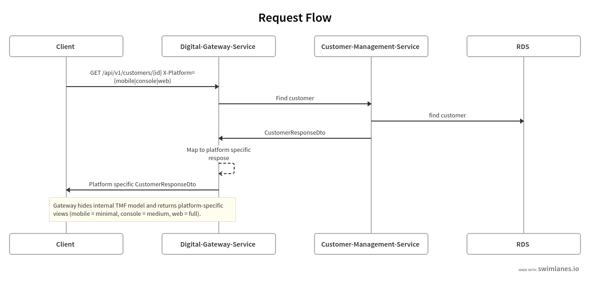
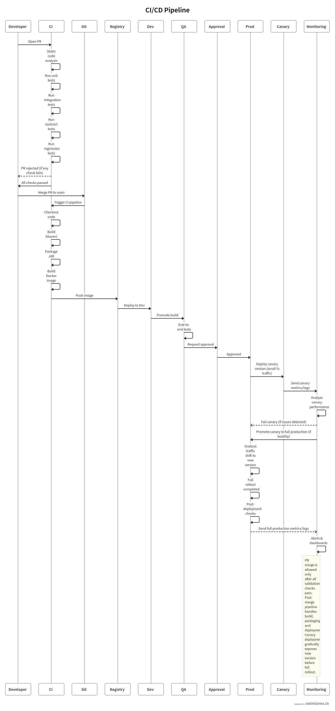

## How to build the project

```bash
mvn clean package
```

---

## How to run the project

```bash
docker-compose up --build
```

---

## Important Links

### Customer Management Service – OpenAPI (simplified)

http://localhost:8081/swagger-ui/index.html

### Digital Gateway Service – OpenAPI

http://localhost:8080/swagger-ui/index.html

---

### H2 Database Console

http://localhost:8081/h2-console

* **JDBC URL:** `jdbc:h2:mem:customerdb`
* **Username:** `sa`
* **Password:**

---

### Postman Collection

Postman collections for both the **customer-management-service** and **digital-gateway-service** can be found under:

```
./docs/postman_collection
```

---

## Architectural Overview

The system follows a microservice architecture where the **Digital Gateway** acts as an aggregation and adaptation layer in front of a TM Forum–compliant **Customer Management API**.

* **customer-management-service**

  * Implements a simplified TM Forum Customer Management API
  * Handles persistence and core business logic

* **digital-gateway-service**

  * Acts as a façade for frontend clients (web, mobile, console)
  * Adapts and filters responses based on platform-specific needs
  * Handles cross-cutting concerns such as error handling and tracing


---

## Further Improvements and Considerations

### Architecture & Modularity

* Extract shared functionality (e.g. distributed tracing, exception handling, common DTOs) into a dedicated **commons/core module**
* Introduce a **BOM (Bill of Materials) module** for centralized dependency management across services
* Consider splitting platform-specific logic into independently scalable services if traffic patterns differ (e.g. mobile vs web)

---

### Configuration & Environment Management

* Introduce environment-specific profiles (`dev`, `qa`, `prod`)
* Externalize configuration (e.g. environment variables, Spring Cloud Config, Vault)
* Avoid hardcoded URLs; use configuration or service discovery

---

### Persistence Layer

* Replace H2 with a production-ready database (e.g. PostgreSQL, MySQL)
* Introduce database migration/versioning using **Flyway** or **Liquibase**
* Avoid using `spring.jpa.hibernate.ddl-auto=update` in production
* Add indexing and proper schema design for scalability

---

### Resilience & Reliability

* Implement resilience patterns for downstream communication:
  * Retry mechanisms
  * Circuit breaker (Resilience4j, Hytrix)
  * Timeouts and fallback strategies
* Provide fallback responses(2nd best response) where applicable (e.g. cached data using Redis)

---

### Observability & Tracing

* Replace manual trace ID handling with **Micrometer Tracing / Spring Cloud Sleuth**
* Introduce:

  * Centralized logging (ELK stack / Splunk/ Coralogix/ Graylog / etc)
  * Metrics collection (Prometheus + Grafana)

---

### API Design & Evolution

* Consider **GraphQL** for flexible, client-driven queries
* Consider **gRPC** for internal service-to-service communication

---

### Security

* Add authentication and authorization
* Validate and sanitize all incoming requests

---

### Testing

* Add:
  * Unit tests 
  * Integration tests
  * Regression tests
  * Contract testing between services

---

### CI/CD

* Implement a CI/CD pipeline including:
  * Automated builds and tests
  * Static code analysis (e.g. SonarQube)
  * Code style enforcement
  * Test coverage checks
  * Automate Docker image build and deployment



---

### Performance

* Enable response compression (GZIP)
* Optimize payload size (especially for mobile clients)
* Introduce caching where appropriate (e.g. Redis)
* Rate limiting